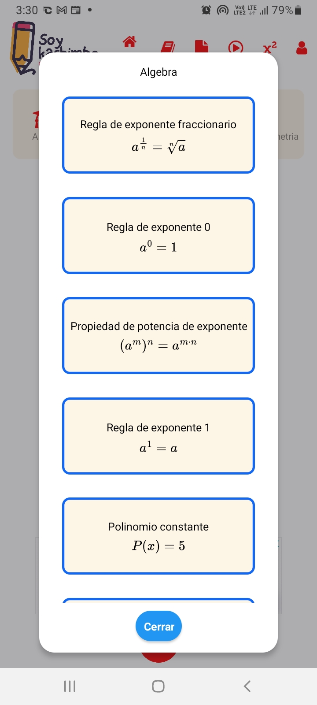
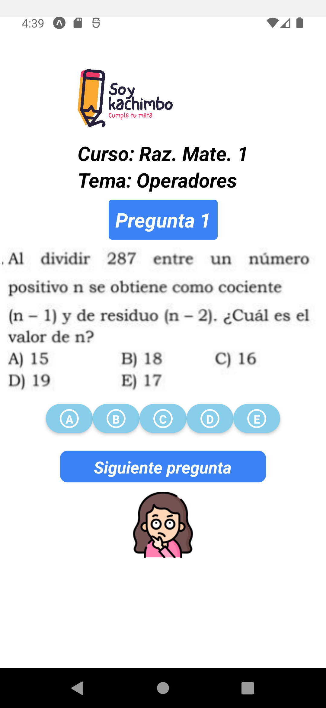

# 📚 Repositorio de Ejercicios Resueltos de Matemática

Bienvenidos al **Repositorio de Ejercicios Resueltos de Matemática**, una aplicación diseñada especialmente para estudiantes preuniversitarios que se están preparando para su ingreso a la universidad. 🌟

## 🚀 Características Principales

- **Ejercicios Resueltos**: Accede a una amplia colección de ejercicios de matemática resueltos paso a paso.
- **Categorías Temáticas**: Explora los temas organizados por álgebra, geometría, trigonometría, entre otros.
- **Búsqueda Rápida**: Encuentra rápidamente los ejercicios que necesitas.
- **Interfaz Intuitiva y Moderna**: Diseñada con un enfoque minimalista y agradable a la vista.

---

## 🖼️ Capturas de Pantalla

<p align="center">
  
  
  
  
</p>


---

## 🛠️ Tecnologías Utilizadas

- **Frontend**: React Native con Expo 📱
- **Backend**: Firebase 🔥
- **Estilos**: Tailwind CSS 🎨

---

## 🏗️ Instalación y Configuración

Sigue estos pasos para ejecutar el proyecto localmente:

1. **Clona este repositorio**:
   ```bash
   git clone https://github.com/AlessS4ndro69/Soykachimbo.git
   ```

2. **Navega al directorio del proyecto**:
   ```bash
   cd Soykachimbo
   ```

3. **Instala las dependencias**:
   ```bash
   npm install
   ```

4. **Inicia el entorno de desarrollo con Expo**:
   ```bash
   expo start
   ```

## 🌐 Demo

> https://apkpure.com/p/com.aless4ndro.soykachimbo

---

## 💡 Contribuciones

¡Nos encantaría contar con tu ayuda! 🎉 Si deseas contribuir:

1. Haz un fork de este repositorio.
2. Crea una rama con tu funcionalidad:
   ```bash
   git checkout -b mi-nueva-funcionalidad
   ```
3. Realiza tus cambios y haz commit:
   ```bash
   git commit -m "Añadida nueva funcionalidad"
   ```
4. Haz un push a tu rama:
   ```bash
   git push origin mi-nueva-funcionalidad
   ```
5. Crea un Pull Request.

---

## 🤝 Licencia

Este proyecto está bajo la Licencia MIT. ¡Siéntete libre de usarlo y mejorarlo! 📝

---

## 🌟 Agradecimientos

A todos los estudiantes, profesores y colaboradores que inspiraron este proyecto. ¡Gracias por apoyar el aprendizaje y la educación! 🙌

---

### 📧 Contacto

Si tienes alguna pregunta o sugerencia, no dudes en contactarme:
- ✉️ **Email**: [emamanix@gmail.com](mailto:emamanix@egmail.com)
- 💻**GitHub**: [https://github.com/AlessS4ndro](https://github.com/AlessS4ndro69)
- 📞**Whatsapp**: [Envíame un mensaje](https://wa.me/51925968311)

---
